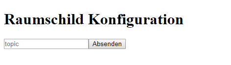
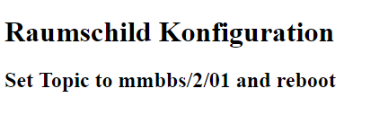

# ESP32 Raumbelegungsanzeige
Ist kein Topic hinterlegt oder wird beim Starten des ESP32 der interne GPIO Button gedrückt, so startet der ESP32 im Access Point Modus. Es wird ein offener WLAN angezeigt. Wird sich mit diesem WLAN verbunden kann die Kanfigurationsseite durch Eingabe von *http://192.168.4.1* aufgerufen werden. Es erscheint folgende Webseite:

Hier kann der MQTT Topic eingegeben werden. Ein Klick auf "Absenden" startet den ESP32 dann neu.

## Verkabelung

Display | ESP32 
--- | --- 
BUSY | D4 
RST | D21 
DC | D22 
CS | D5 
CLK | D18 
DIN | D23 
GND | GND 
3.3V | 3.3V 

## Video
